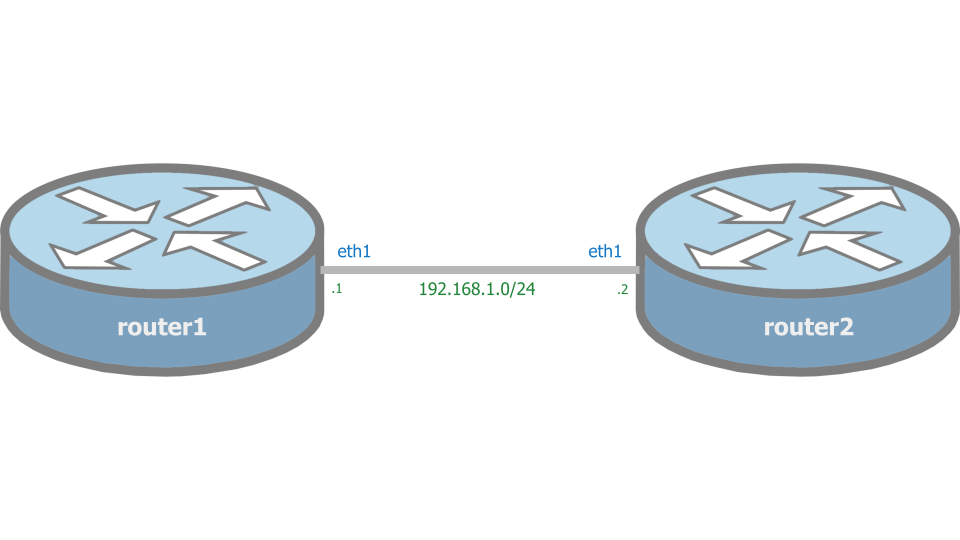

# Network Labs

## Installing Containerlab

Comes pre-installed in the test VM.

```bash
⇨  bash -c "$(curl -sL https://get-clab.srlinux.dev)"
Downloading https://github.com/srl-labs/containerlab/releases/download/v0.14.4/containerlab_0.14.4_linux_amd64.rpm
Preparing to install containerlab 0.14.4 from package

                           _                   _       _     
                 _        (_)                 | |     | |    
 ____ ___  ____ | |_  ____ _ ____   ____  ____| | ____| | _  
/ ___) _ \|  _ \|  _)/ _  | |  _ \ / _  )/ ___) |/ _  | || \ 
( (__| |_|| | | | |_( ( | | | | | ( (/ /| |   | ( ( | | |_) )
\____)___/|_| |_|\___)_||_|_|_| |_|\____)_|   |_|\_||_|____/ 

    version: 0.14.4
     commit: 34e8301
       date: 2021-06-06T07:42:18Z
     source: https://github.com/srl-labs/containerlab
 rel. notes: https://containerlab.srlinux.dev/rn/0.14.4
```

## Running a Topology

### Container images

You need the following container images to run this examples:

- [FRR](https://hub.docker.com/r/frrouting/frr)
- [cEOS](get_arista_ceos.md)

### Topology file

```yaml
name: mylab

topology:
  nodes:
    router1:
      kind: linux
      image: docker.io/frrouting/frr:v7.5.1
      binds:
        - router1/daemons:/etc/frr/daemons
        - router1/frr.cfg:/etc/frr/frr.conf
    router2:
      kind: ceos
      image: ceos:4.25.4M

  links:
    - endpoints: ["router1:eth1", "router2:eth1"]
```

<p align="center">
  <br>
</p>

### Launching the topology

```bash
 ⇨  sudo clab deploy --topo topology.yml
INFO[0000] Parsing & checking topology file: topology.yml 
INFO[0000] Pulling docker.io/frrouting/frr:v7.5.1 Docker image 
INFO[0000] Done pulling docker.io/frrouting/frr:v7.5.1  
INFO[0000] Pulling docker.io/frrouting/frr:v7.5.1 Docker image 
INFO[0000] Done pulling docker.io/frrouting/frr:v7.5.1  
INFO[0000] Creating lab directory: /home/fedora/lab/ceos-frr/clab-mylab 
INFO[0000] Creating docker network: Name='clab', IPv4Subnet='172.20.20.0/24', IPv6Subnet='2001:172:20:20::/64', MTU='1500' 
INFO[0000] Creating container: router1                  
INFO[0000] Creating container: router2                  
INFO[0001] Restarting 'router2' node                    
INFO[0001] Creating virtual wire: router1:eth1 <--> router2:eth1 
INFO[0001] Writing /etc/hosts file                      
+---+--------------------+--------------+--------------------------------+-------+-------+---------+----------------+----------------------+
| # |        Name        | Container ID |             Image              | Kind  | Group |  State  |  IPv4 Address  |     IPv6 Address     |
+---+--------------------+--------------+--------------------------------+-------+-------+---------+----------------+----------------------+
| 1 | clab-mylab-router1 | a7e6f829e256 | docker.io/frrouting/frr:v7.5.1 | linux |       | running | 172.20.20.2/24 | 2001:172:20:20::2/64 |
| 2 | clab-mylab-router2 | d66773265dbb | ceos:4.25.4M                   | ceos  |       | running | 172.20.20.3/24 | 2001:172:20:20::3/64 |
+---+--------------------+--------------+--------------------------------+-------+-------+---------+----------------+----------------------+
```

## Accessing the routers

### Via Docker

#### Router 1 (FRR)

```bash
docker exec -it clab-mylab-router1 vtysh
```

#### Router 2 (cEOS)

```bash
docker exec -it clab-mylab-router2 Cli
```

### Via SSH

#### Router 2 (cEOS)

Credentials from the [arista config template](https://github.com/srl-labs/containerlab/blob/master/templates/arista/ceos.cfg.tpl).

```bash
⇨  ssh admin@clab-mylab-router2
(admin@clab-mylab-router2) Password: admin
router2>
```

## Removing the Topology

```bash
⇨  sudo clab destroy --topo topology.yml
```

## References
- [Nokia SR Linux and FRR](https://containerlab.srlinux.dev/lab-examples/srl-frr/)
- [Use Containerlab to emulate open-source routers](https://www.brianlinkletter.com/2021/05/use-containerlab-to-emulate-open-source-routers/)