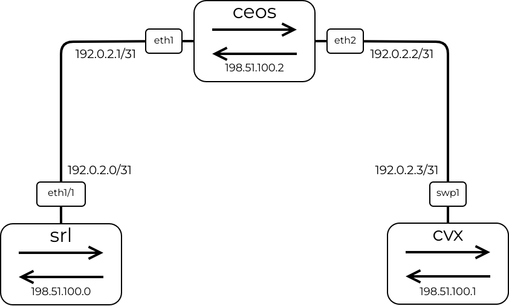

# Virtual Network Topology

<p align="center">
  <br>
</p>

## Launching a Virtual Network Topology

To launch the virtual topology file, run the command `make` from the home folder to access the `Network-Automation-with-Go/topo-base/` folder and run `clab deploy` with root privilege, as the next output shows.

```bash
sudo containerlab deploy -t topo.yml --reconfigure
```

## Destroying the Network Topology

You can destroy the network topology using the `clab destroy` command.

```bash
sudo clab destroy --topo topo.yml
```
